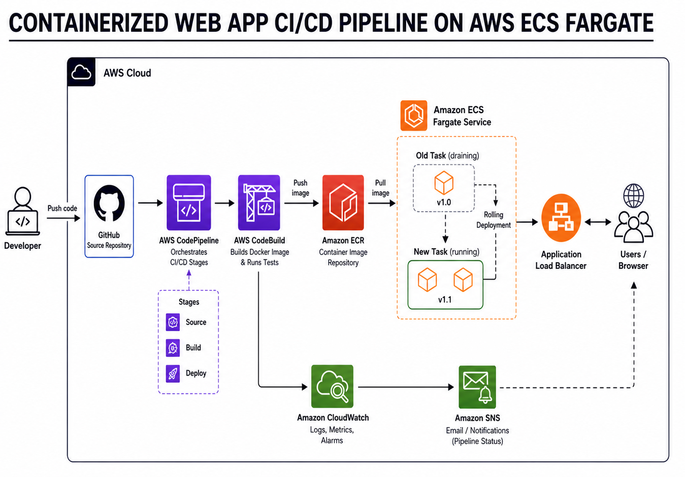
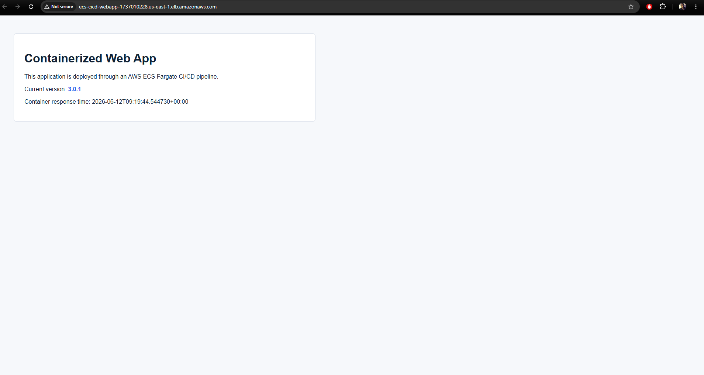
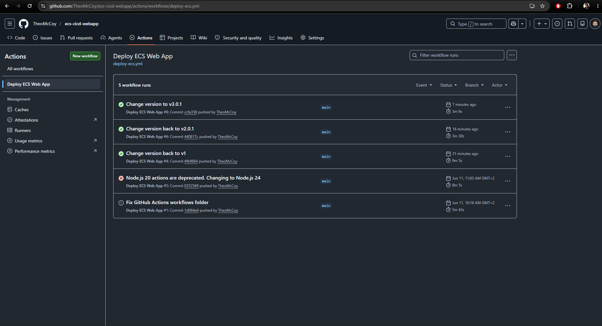
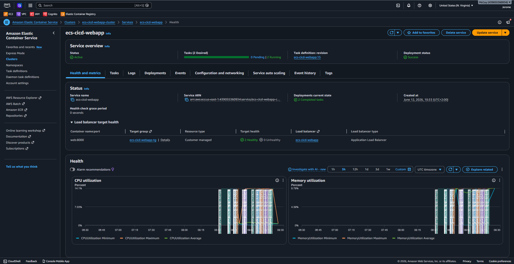
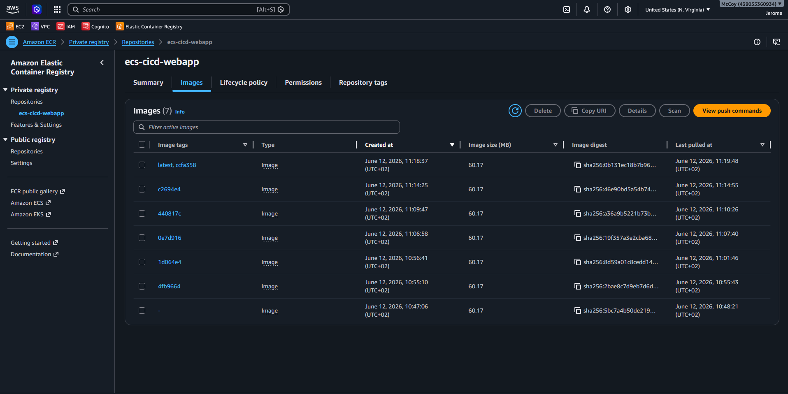

# ecs-cicd-webapp

A production-style AWS ECS CI/CD portfolio project that provisions cloud infrastructure with Terraform and deploys a containerized Python web application to Amazon ECS Fargate through GitHub Actions.

The project demonstrates how to combine Infrastructure as Code, Docker image management, AWS container services, IAM/OIDC authentication, Application Load Balancing, and automated deployment workflows in a clean cloud/DevOps delivery pipeline.

---

## Project Overview

`ecs-cicd-webapp` is a containerized FastAPI web application packaged with Docker and served by Gunicorn using Uvicorn workers. The application is pushed to Amazon ECR and deployed as an ECS Fargate service behind an internet-facing Application Load Balancer.

On every push to the `main` branch, GitHub Actions builds a new Docker image, tags it with the Git commit SHA, pushes it to ECR, creates a new ECS task definition revision, updates the ECS service, waits for deployment stability, and verifies the release through the ALB `/version` endpoint.

---

## Architecture Overview



### Runtime Flow

1. A user sends HTTP traffic to the Application Load Balancer.
2. The ALB forwards traffic on port `80` to the ECS target group.
3. The target group routes traffic to ECS Fargate tasks on container port `8000`.
4. The container runs the Python application using Gunicorn and Uvicorn workers.
5. ECS sends application logs to Amazon CloudWatch Logs.

---

## Tech Stack

| Area | Technology |
|---|---|
| Cloud Provider | AWS |
| Region | `us-east-1` |
| Infrastructure as Code | Terraform |
| Container Runtime | Amazon ECS Fargate |
| Container Registry | Amazon ECR |
| Load Balancing | Application Load Balancer |
| Application | Python FastAPI |
| WSGI/ASGI Server | Gunicorn with Uvicorn workers |
| CI/CD | GitHub Actions |
| Authentication | GitHub OIDC to AWS IAM Role |
| Logging | Amazon CloudWatch Logs |

---

## Repository Structure

```text
.
├── .github/
│   └── workflows/
│       └── deploy-ecs.yml
├── app/
│   ├── Dockerfile
│   ├── main.py
│   └── requirements.txt
├── terraform/
│   ├── main.tf
│   ├── outputs.tf
│   ├── providers.tf
│   ├── variables.tf
│   ├── version.tf
│   └── .terraform.lock.hcl
├── .gitignore
└── buildspec.yml
```

### Application Folder

The `app` folder contains the Python web application and Docker build instructions.

Key endpoints:

| Endpoint | Purpose |
|---|---|
| `/` | Returns the main HTML landing page |
| `/health` | Used by the ALB target group health check |
| `/version` | Used to verify the deployed application version |

The container exposes port `8000` and runs the FastAPI application using:

```dockerfile
CMD ["gunicorn", "-k", "uvicorn.workers.UvicornWorker", "--bind", "0.0.0.0:8000", "main:app"]
```

---

## Infrastructure Provisioned by Terraform

Terraform provisions the AWS infrastructure required to run the containerized application.

### Core Networking

- Custom VPC using CIDR block `10.0.0.0/16`
- Two public subnets across two Availability Zones
- Internet Gateway
- Public route table with default internet route
- Route table associations for public subnets

### Load Balancing

- Internet-facing Application Load Balancer
- HTTP listener on port `80`
- Target group forwarding traffic to ECS tasks on port `8000`
- Health check path: `/health`

### ECS and Containers

- ECS cluster
- ECS Fargate task definition
- ECS service named `ecs-cicd-webapp`
- Desired task count controlled by Terraform variable `desired_count`
- `awsvpc` networking mode
- CloudWatch log group with 14-day retention

### Container Registry

- Amazon ECR repository named `ecs-cicd-webapp`
- Image scan on push enabled
- Mutable image tags for portfolio/demo deployment flexibility

### IAM

- ECS task execution role
- Managed AWS ECS task execution policy attachment
- IAM roles and policies for deployment tooling

### Additional Pipeline Resources

The Terraform code also includes AWS-native CI/CD resources such as CodeBuild, CodePipeline, an S3 artifact bucket, SNS topic, and CodeStar notification configuration. The main documented deployment path for this repository is GitHub Actions, but the included AWS-native pipeline resources show an alternative CI/CD pattern using AWS developer tools.

---

## CI/CD Pipeline with GitHub Actions

Workflow path:

```text
.github/workflows/deploy-ecs.yml
```

The pipeline runs when changes are pushed to the `main` branch and relevant application/workflow files are updated.

### Pipeline Steps

1. Check out the repository.
2. Configure AWS credentials through GitHub OIDC.
3. Log in to Amazon ECR.
4. Build the Docker image from `./app`.
5. Tag the image using the short Git commit SHA.
6. Push both the SHA-tagged image and `latest` tag to ECR.
7. Download the current ECS task definition.
8. Create a new ECS task definition revision with the updated image URI.
9. Update the ECS service to use the new task definition revision.
10. Wait for the ECS service to become stable.
11. Verify the deployment through the ALB `/version` endpoint.

### Required GitHub Repository Variables

The workflow uses the following GitHub Actions repository variables:

| Variable | Description |
|---|---|
| `ECS_CLUSTER_NAME` | ECS cluster name from Terraform output |
| `ECS_SERVICE_NAME` | ECS service name from Terraform output |
| `ECR_REPOSITORY_URL` | ECR repository URL from Terraform output |
| `ALB_URL` | Application Load Balancer URL from Terraform output |

These values can be retrieved after `terraform apply`:

```powershell
cd terraform

terraform output -raw ecs_cluster_name
terraform output -raw ecs_service_name
terraform output -raw ecr_repository_url
terraform output -raw alb_url
```

Important: the ECS service name is:

```text
ecs-cicd-webapp
```

It is not:

```text
ecs-cicd-webapp-service
```

### Required GitHub Secret

The workflow assumes an AWS IAM role through OIDC. The repository secret must be named exactly:

```text
ECS_CICD_WEBAPP_GITHUB_ACTIONS_ROLE
```

Example credentials step:

```yaml
- name: Configure AWS credentials
  uses: aws-actions/configure-aws-credentials@v6
  with:
    role-to-assume: ${{ secrets.ECS_CICD_WEBAPP_GITHUB_ACTIONS_ROLE }}
    aws-region: us-east-1
```

Secret names matter. If the workflow references a different secret name, AWS credential configuration will fail.

---

## GitHub OIDC and IAM Design

This project uses GitHub OpenID Connect instead of long-lived AWS access keys.

### OIDC Provider

AWS IAM OIDC provider:

```text
token.actions.githubusercontent.com
```

Audience:

```text
sts.amazonaws.com
```

### Trust Policy Design

The IAM role trust policy should restrict access to this specific repository and the `main` branch.

Example trust policy condition pattern:

```json
{
  "StringEquals": {
    "token.actions.githubusercontent.com:aud": "sts.amazonaws.com"
  },
  "StringLike": {
    "token.actions.githubusercontent.com:sub": "repo:<github-owner>/ecs-cicd-webapp:ref:refs/heads/main"
  }
}
```

This limits role assumption to the intended GitHub repository and branch.

### Required IAM Permissions

The GitHub Actions IAM role needs permissions for:

- ECR authentication and image push
- ECS service discovery
- ECS task definition discovery
- ECS task definition registration
- ECS service updates
- `iam:PassRole` for the ECS task execution role and task role, where applicable

---

## Manual Deployment Process

Before CI/CD automation, the application can be built, pushed, and deployed manually.

```powershell
cd terraform

$repo = terraform output -raw ecr_repository_url

docker build -t "${repo}:bootstrap" ../app
docker push "${repo}:bootstrap"

aws ecs update-service `
  --cluster $(terraform output -raw ecs_cluster_name) `
  --service $(terraform output -raw ecs_service_name) `
  --force-new-deployment

$url = terraform output -raw alb_url
Invoke-RestMethod "$url/version"
```

The initial ECS task definition references a `bootstrap` image tag. This makes the first deployment possible before the automated CI/CD pipeline begins publishing commit-SHA images.

---

## Deployment Verification

The pipeline verifies the deployment by calling:

```text
/version
```

Example response:

```json
{
  "app": "Containerized Web App",
  "version": "3.0.1"
}
```

The ALB target group uses:

```text
/health
```

Example response:

```json
{
  "status": "healthy",
  "version": "3.0.1"
}
```

---

## Security and Version-Control Practices

This project follows important Infrastructure as Code and repository hygiene practices.

### Files That Should Not Be Committed

The following files and folders should stay out of version control:

```text
.terraform/
terraform.tfstate
terraform.tfstate.backup
terraform.tfvars
*.tfvars
*.tfvars.json
.env
.env.*
```

Terraform state can contain sensitive infrastructure information. Variable files can also contain account-specific or environment-specific values.

### Provider Lock File

The Terraform provider lock file can be committed:

```text
.terraform.lock.hcl
```

Committing this file improves repeatability by locking provider dependency selections across machines and CI environments.

### Good Git Hygiene

The repository is designed to keep generated Terraform files, state files, secrets, local environment files, and provider binaries out of Git. This keeps the repository lightweight, safer to share, and suitable for a public portfolio.

---

## Troubleshooting Lessons Learned

This project includes several practical CI/CD and cloud deployment lessons.

| Issue | Root Cause | Resolution |
|---|---|---|
| GitHub Actions did not run | Workflow directory was named `.github/workflow` instead of `.github/workflows` | Corrected the workflow path |
| AWS credential configuration failed | Workflow referenced the wrong GitHub secret name | Standardized the secret name used by the workflow |
| Docker build failed with `invalid tag ":1d064e4"` | `ECR_REPOSITORY_URL` was empty | Added/validated the GitHub Actions repository variable |
| ECS deployment failed with `Service cannot be empty` | `ECS_SERVICE_NAME` was missing or incorrect | Set the variable to the actual ECS service name: `ecs-cicd-webapp` |
| Node.js 20 warning appeared in GitHub Actions | Older GitHub Actions versions used deprecated runtimes | Updated actions to newer versions |
| Terraform destroy failed because ECR was not empty | ECR repositories cannot be deleted while images exist unless forced | Used `force_delete = true` for portfolio cleanup convenience |

Current workflow actions use newer versions:

```yaml
actions/checkout@v5
aws-actions/configure-aws-credentials@v6
aws-actions/amazon-ecr-login@v2
```

---

## Current Configuration Note

GitHub Actions repository variables are currently populated manually from Terraform outputs. If the Terraform stack is destroyed and recreated, values such as the ALB URL, ECR repository URL, ECS cluster name, or ECS service name may change.

After recreating the infrastructure, refresh these GitHub Actions variables:

```powershell
terraform output -raw ecs_cluster_name
terraform output -raw ecs_service_name
terraform output -raw ecr_repository_url
terraform output -raw alb_url
```

---

## Future Improvements

Planned improvements for a more production-grade workflow:

- Move Terraform state to an S3 backend.
- Add DynamoDB state locking.
- Allow GitHub Actions to run `terraform init` and read Terraform outputs automatically.
- Remove hardcoded GitHub Actions deployment variables.
- Add HTTPS using ACM and an ALB listener on port `443`.
- Add a custom domain using Route 53.
- Add container image lifecycle policies in ECR.
- Consider `prevent_destroy = true` for ECR in production environments.
- Add automated tests before Docker image publishing.
- Add vulnerability scanning or policy checks before deployment.
- Separate dev/stage/prod environments with Terraform workspaces or environment directories.

Example future GitHub Actions output-reading approach:

```bash
terraform output -raw ecs_cluster_name
terraform output -raw ecs_service_name
terraform output -raw ecr_repository_url
terraform output -raw alb_url
```

---

## Screenshots

Add screenshots here to make the portfolio project easier to understand visually.

### Application Running Behind ALB



### GitHub Actions Successful Deployment



### ECS Service Stable Deployment



### ECR Images Tagged by Commit SHA



---

## Skills Demonstrated

This project demonstrates practical cloud and DevOps skills, including:

- Designing AWS container infrastructure with Terraform
- Building and packaging a Python application with Docker
- Running containers on Amazon ECS Fargate
- Publishing container images to Amazon ECR
- Exposing services through an Application Load Balancer
- Configuring ECS health checks and deployment stability checks
- Using CloudWatch Logs for container logging
- Implementing GitHub Actions CI/CD pipelines
- Using GitHub OIDC for secure AWS authentication
- Managing IAM permissions for deployment automation
- Handling Terraform outputs in deployment workflows
- Practicing safe Git and IaC version-control hygiene
- Troubleshooting real deployment failures across Docker, ECS, IAM, and GitHub Actions

---

## Author

**Lereko Mohlomi**  
Cloud and cybersecurity practitioner building hands-on AWS, Terraform, containerization, and CI/CD portfolio projects.
